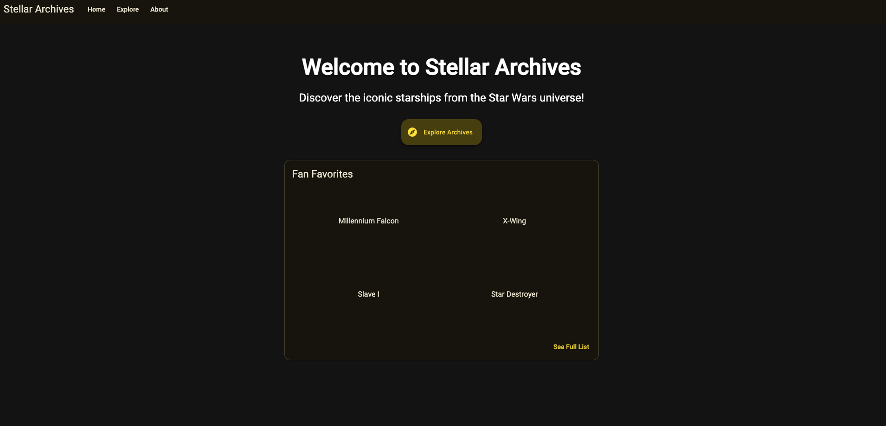

# StellarArchives

Getting Started:

```bash
# Ensure node is latest LTS
nvm use lts/iron
# Install Deps
npm i
# Start app in Dev
npm start
```

Overview:

This app will allow you to explore the Star Wars Universe's Starships from the comfort of your own home.

Screenshots:




Tech Stack:

- Angular v19
- Angular Material 3
- flexboxgrid - [Github](https://github.com/kristoferjoseph/flexboxgrid)
- @ngneat/cashew (caching) - (reduce API calls & rate limit issues)

The theme in this app is a custom one created using `ng generate @angular/material:m3-theme`

Colors:
Primary: `#ffe300`
Secondary: `#cfc7a2`
Tertiary: `#a8d0b6`

Full list in `src/styles/_theme-colors.scss`
